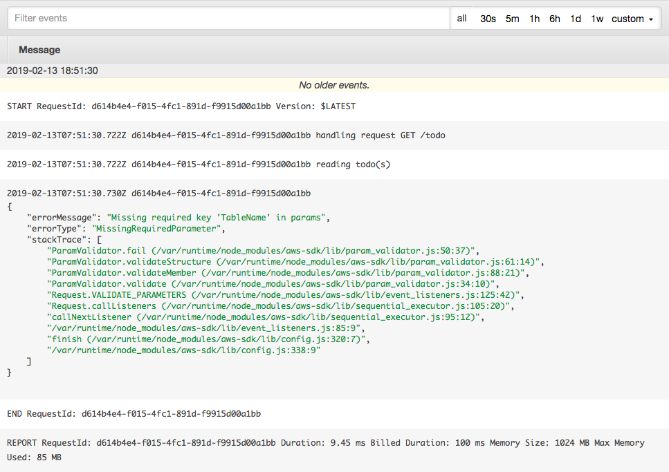
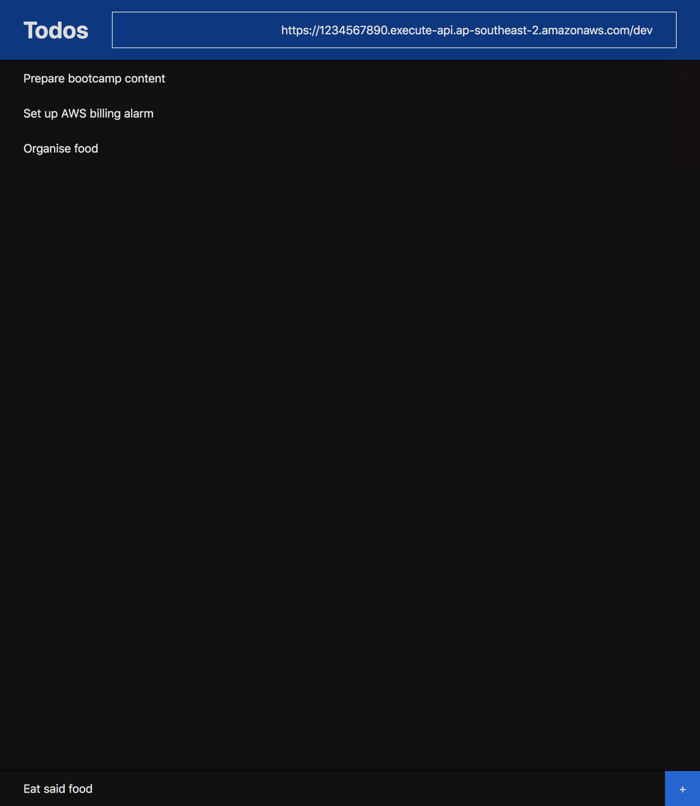

# Serverless Starter TODO

Starter template for a todo app.

```plaintext
S3 -- API Gateway -- Lambda -- DynamoDB
```

## 1. Start with template

Copy starter files from our template:

```shell
serverless create --template-url https://github.com/DevOps-Girls/DevOps-Girls-Bootcamp-4/tree/master/serverless-starter-todo

# Serverless: Generating boilerplate...
# Serverless: Downloading and installing "serverless-starter-todo"...
# Serverless: Successfully installed "serverless-starter-todo"

cd serverless-starter-todo
```

Open the _serverless.yml_ file, which describes a serverless application.

---

It begins by listing out some basic details:

```yaml
service: serverless-starter-todo

provider:
  name: aws
  runtime: nodejs8.10
  stackName: serverless-starter-todo-dev
  stage: dev
```

- We'll be running on AWS
- We're using the Node.js JavaScript runtime for our API
- We'll default the API's stage to pre-production (**dev**)

---

It also includes a CloudFormation resources section at the end, which is AWS's
way of managing infrastructure as code. We can describe a DynamoDB table, S3
bucket, and much more here, and they will be automatically created/updated
whenever we run `serverless deploy`.

```yaml
resources:
  Resources:
    # remove these brackets and add some CloudFormation resources
    {}
```

## 2. Create S3 bucket

```plaintext
S3 -- API Gateway -- Lambda -- DynamoDB
^^
```

---

Have a quick look at the CloudFormation documentation for S3 buckets:

<https://docs.aws.amazon.com/AWSCloudFormation/latest/UserGuide/aws-properties-s3-bucket.html>

---

Describe the bucket under the **resources** section:

```yaml
resources:
  Resources:
    WebsiteBucket:
      Type: AWS::S3::Bucket
      Properties:
        # add properties here
```

Properties that we want to add:

- **WebsiteConfiguration**: we want to configure the bucket for website hosting,
  and set the home page to _index.html_

---

Add a bucket policy below it:

```yaml
WebsiteBucketPolicy:
  Type: AWS::S3::BucketPolicy
  Properties:
    PolicyDocument:
      Version: '2012-10-17'
      Statement:
        - Action: s3:GetObject
          Effect: Allow
          Principal: '*'
          Resource:
            Fn::Join:
              - ''
              - - 'arn:aws:s3:::'
                - Ref: WebsiteBucket
                - /*
    Bucket:
      Ref: WebsiteBucket
```

This allows anyone to read the files in the bucket, which is what we want,
as the website should be accessible from any device or browser.

---

Let's run a `serverless deploy` to create our S3 bucket:

```shell
serverless deploy --region ap-southeast-2 --verbose

# Service Information
# service: serverless-starter-todo
# stage: dev
# region: ap-southeast-2
# stack: serverless-starter-todo-dev
# api keys:
#   None
```

---

Verify your changes in the AWS web interface:

- <https://console.aws.amazon.com/cloudformation/home>
- <https://console.aws.amazon.com/s3/home>

What do you see?

<details><summary>Show</summary><p>

You should see a new CloudFormation stack:


And that stack creation should have included an S3 bucket with a public bucket
policy:


</p></details>

## 3. Upload static website

```plaintext
S3 -- API Gateway -- Lambda -- DynamoDB
^^
```

---

Upload the HTML, CSS and JS files in the `websites` folder to S3:

```shell
aws s3 sync website/ s3://your-bucket-name-here
```

---

Try visiting your website (use your real bucket name):

<http://your-bucket-name-here.s3-website-ap-southeast-2.amazonaws.com/>

What do you see?

<details><summary>Show</summary><p>

You should be able to see the basic layout of the todo app.

However, the todo list would be empty, and you wouldn't be able to add any new
todos. This is because we haven't set up a backend that the website can read
todos from and write todos to.

</p></details>

## 4. Create API

```plaintext
S3 -- API Gateway -- Lambda -- DynamoDB
      ^^^^^^^^^^^^^^^^^^^^^
```

To create a serverless API with API Gateway and Lambda, we need to add two new
sections to our `serverless.yml`: **package** and **functions**.

---

What do you think this section does?

```yaml
package:
  include:
    - handler.js
```

<details><summary>Show</summary><p>

The **package** section describes the code files on your computer that form the
API. This includes logic to write todos to and read todos from a database.

The files included in the package are uploaded to an S3 bucket, so that Lambda
can access the files and run your API.

</p></details>

---

How about this section?

```yaml
functions:
  TodoApi:
    name: serverless-starter-todo-api-dev
    handler: handler.handleCorsRequest
    events:
      - http:
          cors: true
          method: any
          path: /{proxy+}
```

<details><summary>Show</summary><p>

The **functions** section describes a Lambda function that can respond to HTTP
requests.

</p></details>

---

Run the `serverless deploy` command:

```shell
serverless deploy --region ap-southeast-2 --verbose

# Service Information
# service: serverless-starter-todo
# stage: dev
# region: ap-southeast-2
# stack: serverless-starter-todo-dev
# api keys:
#   None
# endpoints:
#   ANY - https://1234567890.execute-api.ap-southeast-2.amazonaws.com/dev/{proxy+}
# functions:
#   TodoApi: serverless-starter-todo-dev-TodoApi
#
# Stack Outputs
# TodoApiLambdaFunctionQualifiedArn: arn:aws:lambda:ap-southeast-2:123456789012:function:serverless-starter-todo-api-dev:1
# ServiceEndpoint: https://1234567890.execute-api.ap-southeast-2.amazonaws.com/dev
# ServerlessDeploymentBucketName: serverless-starter-todo-serverlessdeploymentbuck-abcdefghijkl
```

---

Review your changes in the AWS web interface.

- <https://console.aws.amazon.com/apigateway/home>
- <https://console.aws.amazon.com/lambda/home>

What do you see?

<details><summary>Show</summary><p>

You should see that a new API Gateway has been created:


And a Lambda function has been created and automatically hooked up to that API
Gateway:


</p></details>

---

Try out your new API (use your real service endpoint):

<https://xxxxxxxxxx.execute-api.ap-southeast-2.amazonaws.com/dev/todo>

What do you see?

<details><summary>Show</summary><p>
You should see something like this:

```json
{ "message": "Internal server error" }
```

Let's have a look at the logs to see what happened:

<https://ap-southeast-2.console.aws.amazon.com/cloudwatch/home?region=ap-southeast-2#logEventViewer:group=/aws/lambda/serverless-starter-todo-api-dev>



The issue with our Lambda function is that it's missing the name of the
database table to store our todos in. That's because we haven't created the
database table yet!

</p></details>

## 5. Create database table

```plaintext
S3 -- API Gateway -- Lambda -- DynamoDB
                               ^^^^^^^^
```

We now have an API that we can call from our website to read and write todos.
The API needs to store the todos somewhere, so that they aren't lost once you
close your browser tab, and so you can access them across your laptop, phone,
etc.

---

Have a quick look at the CloudFormation documentation for DynamoDB tables:

<https://docs.aws.amazon.com/AWSCloudFormation/latest/UserGuide/aws-resource-dynamodb-table.html>

---

Add a database table to the **resources** section:

```yaml
resources:
  Resources:
    DatabaseTable:
      Type: AWS::DynamoDB::Table
      Properties:
        # more stuff here
```

Properties that we want to add:

- **AttributeDefinitions**, **KeySchema**: we want to create an **id** primary
  key in our table
- **BillingMode**: set this to **PAY_PER_REQUEST** to avoid paying ongoing costs
  while the database is not doing anything

---

Run `serverless deploy` to create your database table:

```shell
serverless deploy --region ap-southeast-2 --verbose
```

---

Review your changes in the AWS web interface:

<https://console.aws.amazon.com/dynamodb/home>

What do you see?

<details><summary>Show</summary><p>
You should see a new DynamoDB table:


</p></details>

## 6. Connect the dots

```plaintext
S3 -- API Gateway -- Lambda -- DynamoDB
^^^^^^^^^^^^^^^^^^^^^^^^^^^^^^^^^^^^^^^
```

Add your database table name as an environment variable for your Lambda
function:

```yaml
functions:
  TodoApi:
    name: serverless-starter-todo-api-dev
    handler: handler.handleCorsRequest
    environment:
      TABLE_NAME: your-table-name-here
    events:
      - http:
          cors: true
          method: any
          path: /{proxy+}
```

Run `serverless deploy` to update your Lambda function:

```shell
serverless deploy --region ap-southeast-2 --verbose
```

---

Paste your API URL into the top right textbox of your website:


---

Try to add, edit, and delete some todos!



## A. What's next

Some ideas:

- Authentication and authorisation
- HTTPS and a nice domain name
- Completing todos, changing their order, etc.
